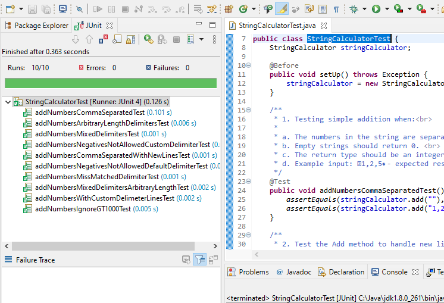

String Calculator 
-----------------------------------------
A Calculator to add numbers list.

Requires: >= Java 8, >= [JUnit 4](https://mvnrepository.com/artifact/junit/junit/4.0)(Only to execute Unit tests)

**Running Calculator**

1. Import project in eclipse and run from there OR
1. Use command to compile and run the `StringCalculator.java`.
    1. Info to use command line to compile and run java file: [Help](https://www.tutorialspoint.com/How-to-run-a-java-program)
	

See the Examples below to input a string to add numbers

* Example: “1,2,5” - Result: 8 `//Simple string values separated by a comma`
* Example: “1\n,2,3” - Result: 6 `//Simple string values new lines in the input format`
* Example: “1,\n2,4” - Result: 7
* Example: “//;\n1;3;4” - Result: 8 `//Input Supporting a custom delimiter Format like: “//[delimiter]\n[delimiter separated numbers]”`
* Example: “//$\n1$2$3” - Result: 6
* Example: “//@\n2@3@8” - Result: 13
* Example: -10  - Result: Throws an exception `//With message i.e Negatives not allowed: Offending list -10`
* Example: “2,1001” - Result: 2 `//Numbers larger than 1000 will be ignored`
* Example: “`//***\n1***2***3`” - Result 6 `//Delimiters with arbitrary length`
* Example: “//$,@\n1$2@3” - Result 6 `//Use multiple delimiters in input string`
* Example: “//$$$,@\n1$$$2@3” - Result 6 `// Use arbitrary length and  multiple delimiters as separator`

**Running Calculator Tests**

1. Import the project into eclipse and run from there 
    1. How to run unit test from eclipse? [Help](https://www.toolsqa.com/java/junit-framework/running-junit-tests-eclipse/) OR
1. Use the command line to compile and run the tests from following file `StringCalculatorTest.java`.
    1. Info to use command line to run unit tests: [Help](https://www.codejava.net/testing/how-to-compile-and-run-junit-tests-in-command-line)

Each test also contains multiple inputs and asserts.
 

